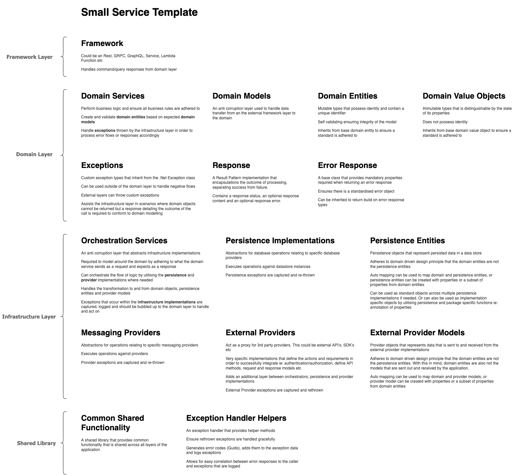

# CSharp Web Service Templates

  

### What is this repository for?

  

This repository consists of CSharp templates following principles from Domain Driven Design and Clean Architecture.

The intention of these templates are to:

  

* Provide base application implementations and boiler plate code for fundamental application processes, ensuring applications align to the same set of standards and principles.

* Give flexibility to design and develop a set business processes and rules (the domain) but also provide standard structure and support around the variable domain functions.

* Provide adaptability to different data stores or cloud providers, without impacting the business logic. This allows for ease of infrastructure migration if needed with no impact to the business domain.

* Provide adaptability to different top level frameworks, whether it be Web APIs or Worker Services, without impacting the business logic. This allows for the transforming of the framework implementation if needed with no impact to the business domain.

  

This respository consists of two templates:

  

*  **CQRService** - Implements CQRS, aimed for larger projects

*  **SmallService** - Aimed for smaller lightweight projects

  

#### Installing the template

1. To install the template, run "dotnet new install <path-to-template>"

3. To use the template, navigate to the repo folder and run "dotnet new <template-identifier>" -n <solution-name>

  

#### Uninstalling the template

1. Using commandline, navigate to the template source code folder that contains the **.template.config** folder

2. Running "dotnet new uninstall <template-identifier>"

  

#### Notes

* Delete the .vs before opening the solution.

* When creating a template, the solution cannot contain a -(hyphen). The folders will be created correctly but the solutionfile will default to use an underscore

  

### About the Layers

  

*  **The Domain Layer** Encapsulates all the business rules and logic, including domain services, always valid domain entities, domain value objects and domain aggregates. This is the part that creates a ubiquitous language between all parties and is something that can be understood by both technical and non-technical groups. All layers in an application conform to the domain and thus the domain holds no reference to any other layer.

  

*  **The Framework Layer** Allows a framework to be added on top of the domain. This could be a Rest, GRPC or GraphQL API, a Service, a Lambda function etc. An example of a Rest Web API is provided.

  

*  **The Application Layer in CQRS** Deals with command and query responsibility and contains no logic. Queries can be processed directly against the infrastructure and commands can be processed by the domain logic.

  

*  **The Infrastructure Layer** Allows the domain to be both persistence and provider ignorant and provides an anti corruption layer in order to ensure the integrity of the domain. This layer deals with data stores, messaging providers, external systems etc.

  

*  **The Shared Layer** A library that provides common functionality that is shared across all layers of the application.

  

### A set of standard features

  

The templates provide a base set of features for common application processes:

  

*  **Standardised Environments:** Supports multiple environments by settings the ASPNETCORE (for Web API's) and DOTNETCORE (for worker services) environment variables. These can be set via launchsettings for Local or on the server for hosted environments. Supported environment for local development is **Local**.

  

*  **Standardised Application Settings:** Appsetting json files are provided to allow for default settings and overrides. These can be used for deployment or application setting overrides can be configured as part of IaC, which is generally the preffered method. The appsettings.Local.json can be used to override default configurations when developing locally.

  

*  **Standardised Docker Builds:** An example docker file is provided to build the framework layer with it's dependent domain, infrastructure, shared and application (in CQRS) layers. These are built into a docker image to be run as a container. Docker files can be written for your application specific needs.

  

*  **Standardised IoC Container:** Each layer supports adding to the IoC container, used for dependency injection, independently. This ensures that each layer is responsible for handling it's own dependencies by adding layer specific services to the container.

  

*  **Standardised Logging:** The templates use the Serilog .Net logging library, which is configured in the application settings and on application startup. For all environments, Serilog will log to the console by default. For the Local environment, Serilog will also log to the Seq sink. Seq is a self-hosted server for structured log search, analysis, and alerting. Please refer to **setting up debug logging with Seq** to get it running.

  

*  **Standardised Testing:** The templates provide unit test projects that cover test cases across the domain, application for CQRS and infrastructure layers. These are true isolated unit tests that mock their dependencies. It also provides a framework for integration test using Specflow to test all the layers work together as a group to perform a task from beginning to end. Integration tests can be coded to provide the ability to mock any persistence or 3rd party external providers that a system may not want to perform any tests against.

  

*  **Standardised Infrastructure Implementations:** Boiler plate code for persistence implementations for common relational and non-relational data stores to connect to and perform CRUD operations against. Boiler plate code for provider implementations for common messsaging data providers to connect to and perform operations against.

  

*  **Standardised Response Handling:** The Result Pattern is used to encapsulate the outcome of an operation in the domain services, in a way the distinctly separates success from failure. To achieve the Result Pattern a class of type **Response** found in the domain layer is used, consisting of a response status, an optional response content and an optional error response. And a base class of type **Error Response** found in the domain layer is used, consisting of an error code, error reason and error message. To handle any errors a derived type of the base error response class can be created. This provides a standard mechanism for handling, formatting and responding to errors. By default some general error response types are provided ie: domain validation error response and system error response. This provides a standard implementation of response handling from the domain services and the application queries in the cqrs model. You can choose to return a successful or failed responses from the domain to the framework layer.

  

*  **Standardised Exception Handling:** A class type of **Exception Handler Helper** is found in the shared library. This helper class is utilised in exception catch blocks. The class is used to provide standard error code generation when exceptions occur, and also ensures exceptions are logged along with their generated error code. By logging and returning the error code, we are able to correlate error responses to log entries to find the details on why the exceptions occurred.

  
  

### Domain driven design application architecture

  

  

  
  ### Kafka Event Streaming
  To use an event object for a topic, generate a JSON schema representation of the object using the tooling application to generate the JSON Schema file, copy the contents of that schema and use that in the schema registry for the given topic. 
  ### Note - JSON schema is preferred over AVRO due to developer tooling available.     
  

#### Setting up debug logging with Seq

1. Pull the Seq image from Docker Hub: https://hub.docker.com/r/datalust/seq

2. Run a container for Seq

* You'll need to use the docker run command to do this and not Docker Desktop as you'll need to accept the EULA

* The Seq ingestion runs on port 5341 by default

* The Seq UI runs on por 80 by default

* docker run --name seq -d --restart unless-stopped -e ACCEPT_EULA=Y -p 80:80 -p 5341:5341 datalust/seq

3. Ensure you have the correct port configuration in your local app settings for Seq

4. You should then be able to view the dashboard on your local machine: http://localhost:80

  

### Notes

The in-memory DB is not thread safe, do not use this in production!